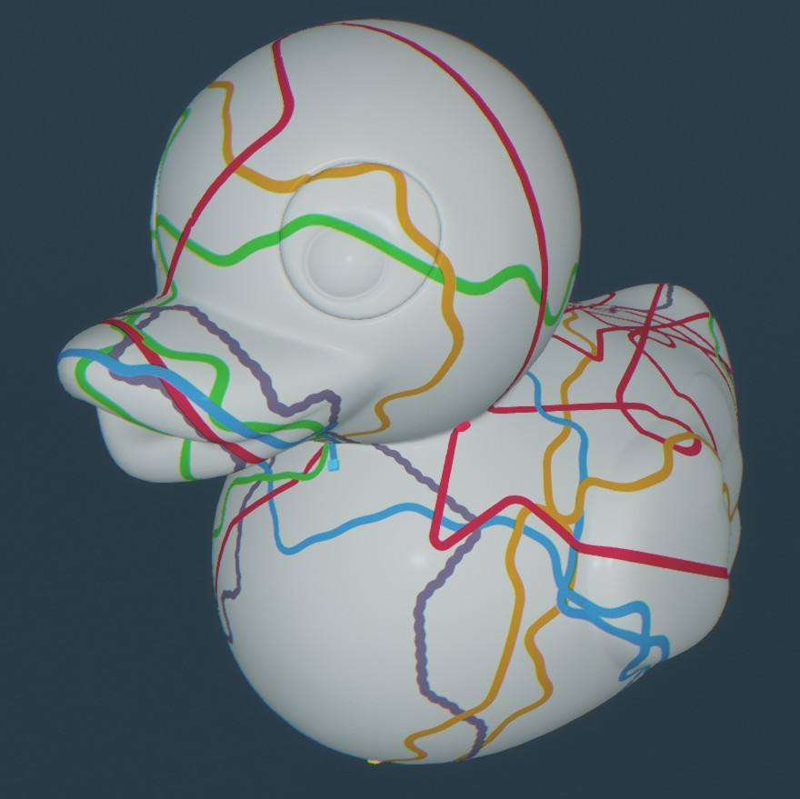

# Duck-Paint

Игрушка по раскараске 3D уточки https://avin.github.io/duck-paint/

# Возможности

- 2 режима: Езда кистью + Свободное рисование
- Дополнительные опоненты на поле (только в режиме езды)

# Управление

В игре доступной два режима - переключение между режимами производится 
кнопками на верхней панеле.

## В режиме езды

- Поворачиваем кистью клавишами `влево`/`вправо` (или кнопками `A` и `D`); 
- Ускоряемся `стрелкой вверх` (или клавишой `W`); 
- Меняем камеру кнопкой `TAB`
(альтернативной камерой доступно вращение с помощью мышки)

## В режиме свободного рисования

- Рисуем по уточке левой кнопкой мыши; 
- Поворачиваем уточку зажимая среднюю  кнопку мыши при этом вращаем мышкой.

 
# Респектосы

Передаю приветы и выражаю благодарности:

- Компании ["КреоБитс"](https://www.dra.ru/) за организацию конкурса.
- Разработчикам [Babylon.js](https://www.babylonjs.com/), а также [коммюнити](https://forum.babylonjs.com/) этой неимоверно крутой библиотеки :)
- Telegram-сообществам [WebGL & Three.js](https://t.me/threejs_ru) и [GameDev for Web](https://t.me/gamedevforweb)
- [@eXponenta](https://github.com/eXponenta) за поддержку и обменом идей.
